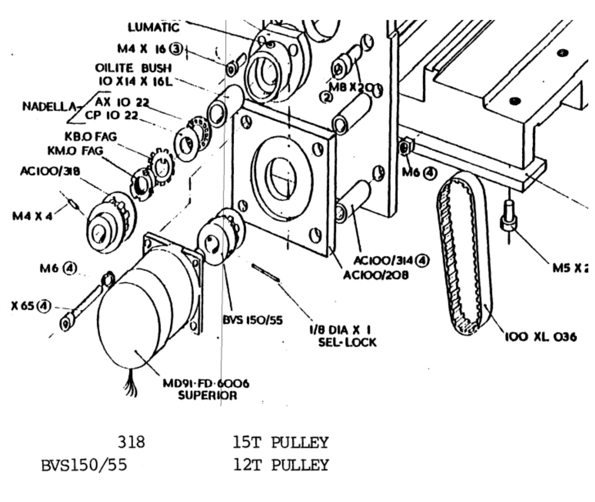
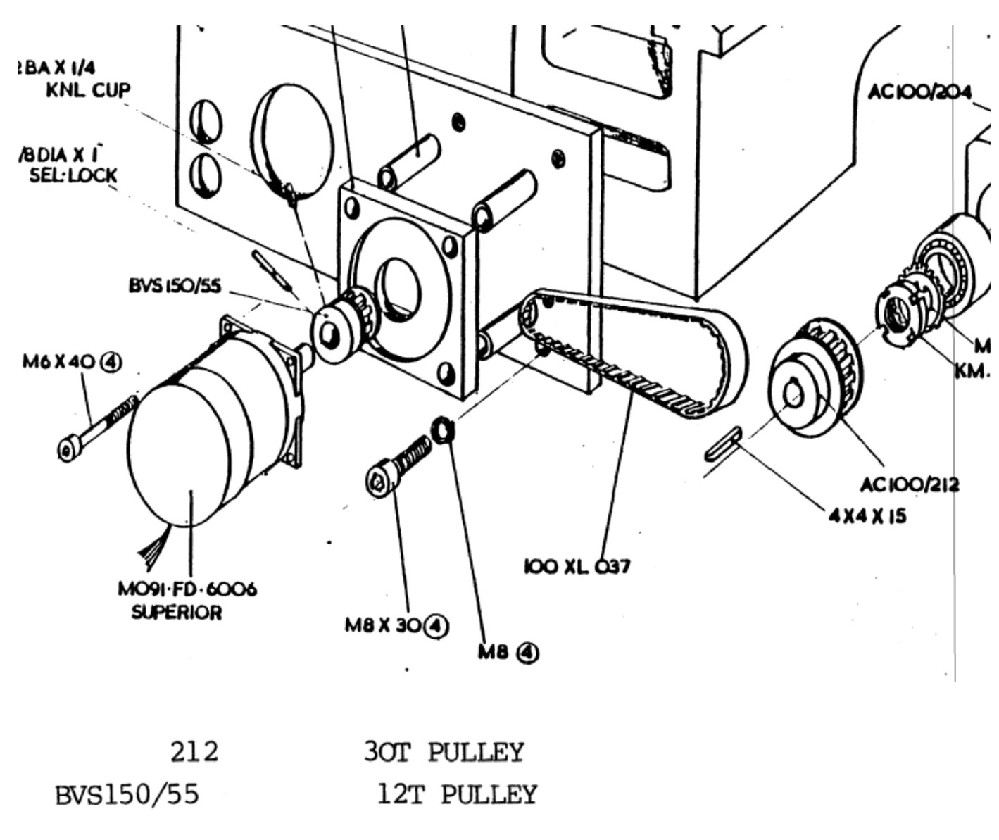

# Denford ORAC Linux CNC Configuration

This directory contains HAL files for the hardware in this project and specifically for Denford ORAC hardware.

## Getting Started

Download the Linux CNC 2.9.8 RPI4 or RPI5 image with PREEMPT_RT from the linuxcnc downloads section

Write the image to an SD card by extracting it and then writing to the SD card

> [!WARN]
> _PLEASE_ use `lsblk` to determine what block device the SD Card is. For my machine which only has an NVME drive as the root, this enumerates as `/dev/sda` which is extremely risky if as you're about to overwrite a complete disk. Make sure it's the correct one before running the command:

```sh
unzip image_2026-01-21-raspios-lcnc-2.9.8-trixie-arm64.zip 
sudo su -
cat ./2026-01-21-raspios-lcnc-2.9.8-trixie-arm64.img > /dev/sda \
    && sync \
    && eject /dev/sda
```

With the card written, insert it into the Linux CNC RPi and go through the initial setup. I also recommend setting up the ssh service so you can remotely administer the lathe:

```sh
sudo systemctl enable ssh
sudo systemctl start ssh
```

Log in through SSH and disable the hardware intefaces that are defaulted to on so you do not have conflicting GPIO pins. Make sure the following settings are correct in `/boot/firmware/config.txt`:

```
dtparam=i2c_arm=off
dtparam=spi=off
```

Once logged in, you can clone this repository in the home directory and then start up linux CNC. If you've wired everything the same as the schematics and wiring diagram shows, then you can start the linuxcnc session using:

```sh
cd /home/cnc/cnc-controller/linuxcnc-configuration/denford-orac-rpi/
./linuxcnc.sh
```

## LatheMacros Python Dependencies (Debian Trixie)

If the Cycles tab fails with `ValueError: Namespace Rsvg not available`, install the required **system** packages (no venv required):

```sh
sudo apt update
sudo apt install -y python3-gi gir1.2-rsvg-2.0 python3-cairo
```

Optional (removes the non-fatal GTK warning `Failed to load module "canberra-gtk-module"`):

```sh
sudo apt install -y libcanberra-gtk-module libcanberra-gtk3-module
```

Quick verification:

```sh
python3 -c "import gi, cairo; gi.require_version('Rsvg','2.0'); from gi.repository import Rsvg; print('OK: Rsvg + cairo available')"
```

So if you so happen to have a Denford Orac then this'll _just work_.

## Stepper Motor Scales

The stepper motors on the Denford ORAC are standard 1.8deg / step NEMA34 which have `(360 / 1.8)` 200 steps per revolution.

The [MSD752](../manuals/MSD752_stepper_drive.pdf) drivers I'm using have been configured for 4x microstepping to give 800 steps per rev.

The stepper motors do not directly drive the axis, instead they drive the axis through a belt and pulley setup. The [ORAC operating and maintenance manual](../manuals/orac-programming-operating-and-maintenance.pdf) details the size of the pulleys.

### X Axis

For the X cross slide we have the following arrangement



With the stepper using 800 turns per we can calculate the scale for the x-axis stepper motor stepgen.

The ballscrew is 8mm x 2.5mm pitch

Calculate the number of steps it takes to make a complete revolution of the ballscrew through the pulleys with the motor and driver using 800 steps per rev:

    800 * (15/12) = 1000

One revolution of the ballscrew will move the carriage 2.5mm and we want to know how many steps are required to complete one unit of measurement in the HAL. For me, that's 1mm as everything is metric for me.

    1000 / 2.5 = 400

This gives each step a distance of `0.0025mm`


### Z Axis

For the Z axis we have the following arrangement



The ballscree is 20mm x 5mm pitch

Calculate the number of steps it takes to make a complete revolution of the ballscrew through the pulleys with the motor and driver using 800 steps per rev:

    800 * (30 / 12) = 2000

One revolution of the ballscrew will move the carriage 5mm and we want to know how many steps are required to complete one unit of measurement in the HAL. For me, that's 1mm as everything is metric for me.

    2000 / 5 = 400

This gives each step a distance of `0.0025mm`

