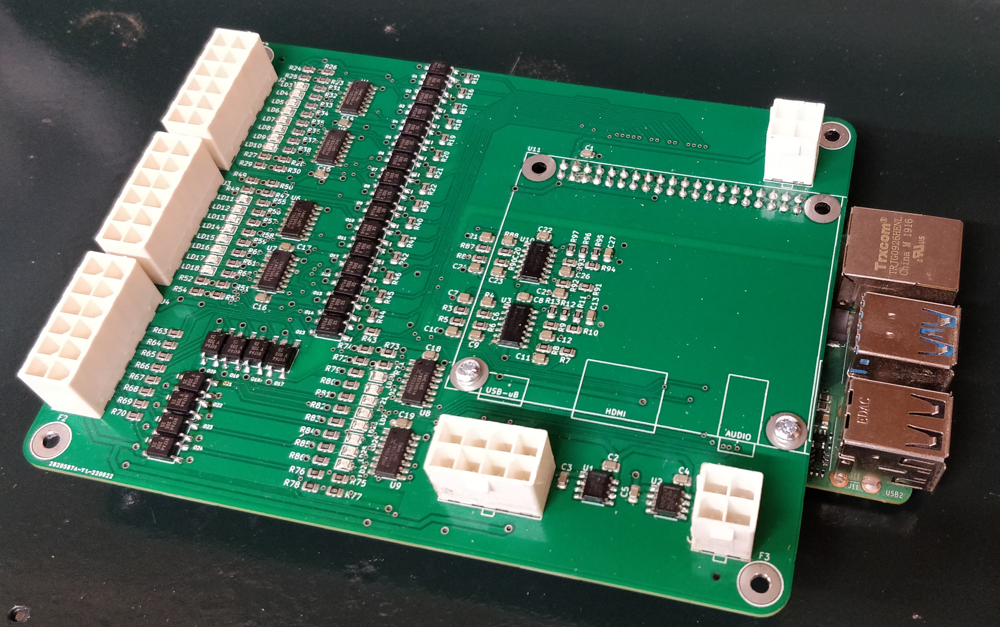

# CNC Controller

This CNC controller is an expansion board for LinuxCNC. See the [electronics](electronics/readme.md) section for the RPi GPIO expansion board suitable for use with LinuxCNC using the [configuration](linuxcnc-configuration/denford-orac-rpi/readme.md).

The PCB is an opto-isolation IO expansion board featuring:

- 16 Opto-isolated outputs (With indicator LED)
- 8 opto-isolated inputs (With indicator LED)
- 2 0-10V analogue outputs connected to two of the opto-isolated outputs



## KiCAD Parts Library

This project relies on my KiCAD parts library. So you will need to also clone a copy of my
[KiCAD parts library](https://github.com/BrianSidebotham/kicad-parts).

Then, you can tell KiCAD where to find the parts library by creating a new environment
variable called `KICAD_BJS_KICAD_PARTS` and set the value to the path to the parts library.

If you get the value or variable name wrong you'll see a lot of missing symbols in the
project.

## Build LinuxCNC

You can go ahead and download the LinuxCNC Distribution or else you can build yourself an up-to-date version.

In order to get an up-to-date version, download the LinuxCNC RPi image and write it to an SD Card.

Boot the card and then do the following to update the LinuxCNC package:

```shell
$ wget https://www.linuxcnc.org/dists/buster/2.8-rtpreempt/binary-armhf/linuxcnc-uspace_2.8.4_armhf.deb
$ sudo dpkg -i ./linuxcnc-uspace_2.8.4_armhf.deb
```

## Future Buildroot

In order to build an OS specifically for LinuxCNC you can use the following instructions:

>**WARNING**: These instructions are for future use, do not use yet.

```shell
$ wget https://buildroot.org/downloads/buildroot-2022.02.5.tar.gz
$ tar xf buildroot-2022.02.5.tar.gz
$ cd buildroot-2022.02.5
$ make raspberrypi4_64_defconfig
```
